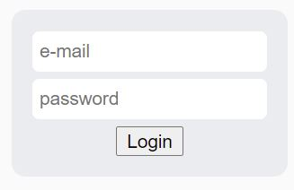

# Simple WebDriver Login Project

##### Local NodeJS Server
* cd .\server
* node app.js

Resultant Local server:
[http://localhost:3000/](http://localhost:3000/ "Local NodeJS server")




##### Selenium Tests
Use the Gradle wrapper to run tests from command line.

```
.\gradlew clean test
BUILD SUCCESSFUL
```

Junit report available 
[./build/reports/tests/test/index.html](./build/reports/tests/test/index.html)


